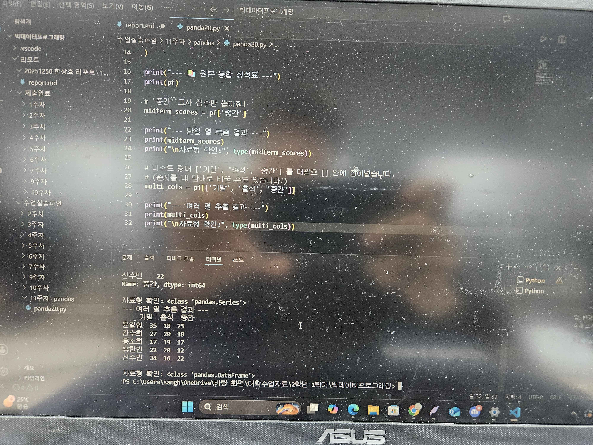
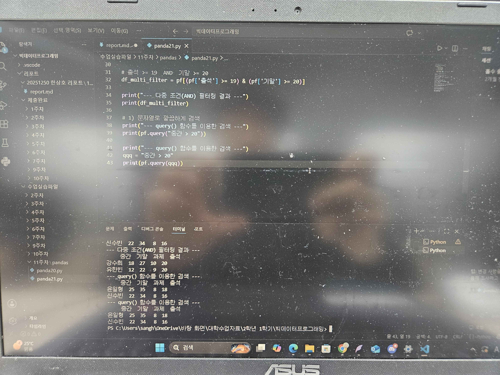
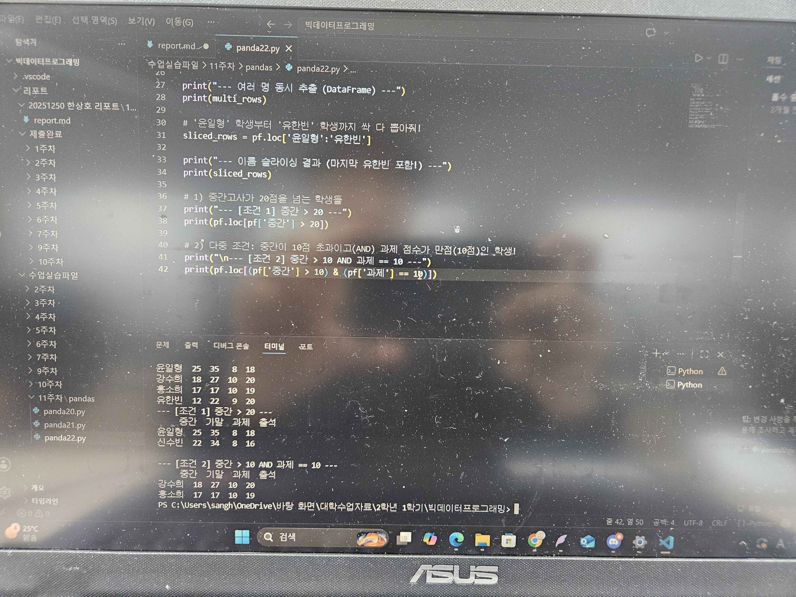
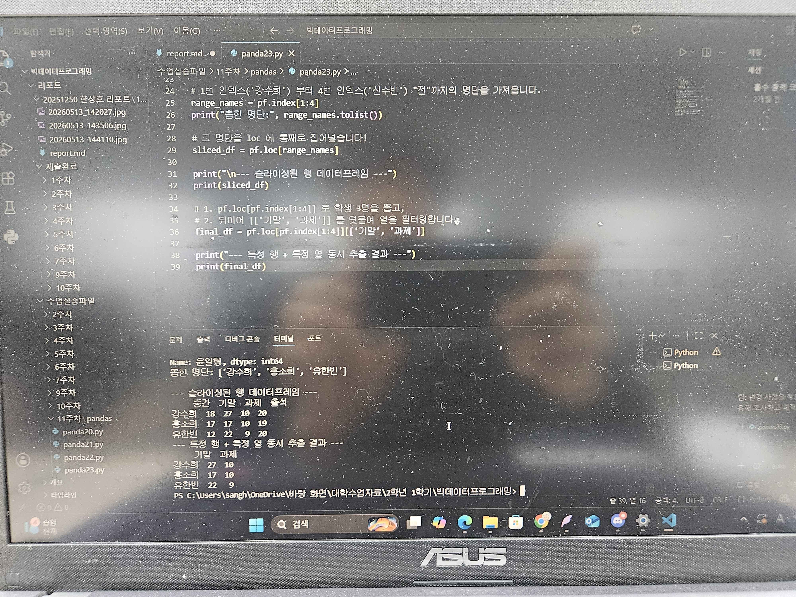
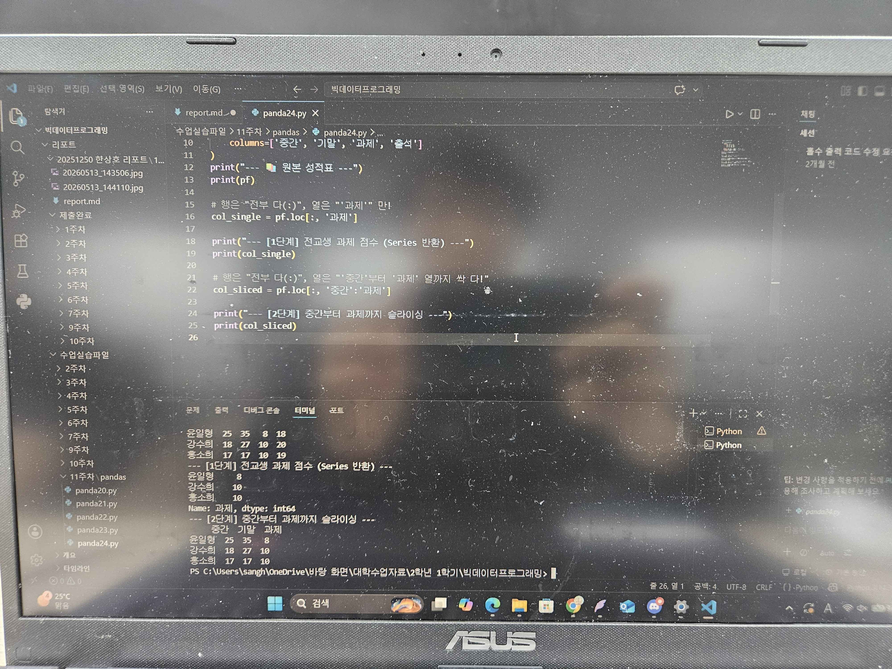
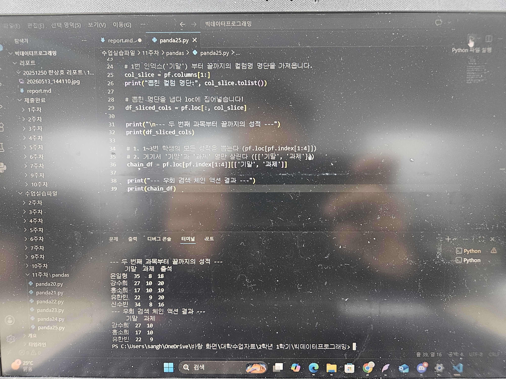
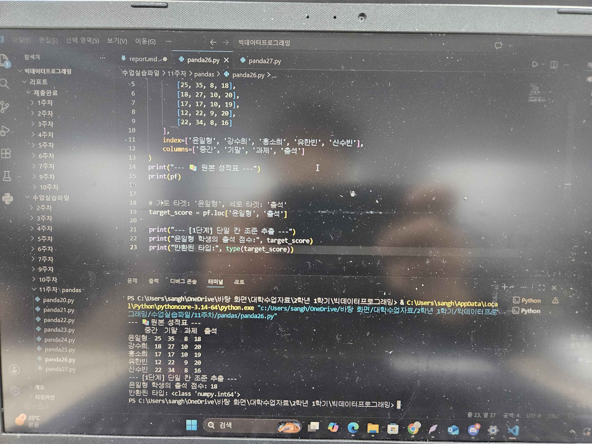
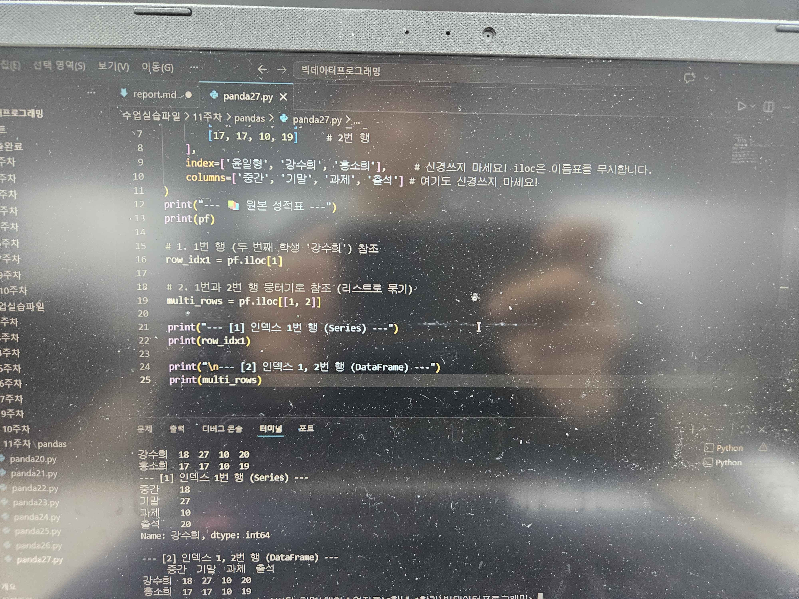
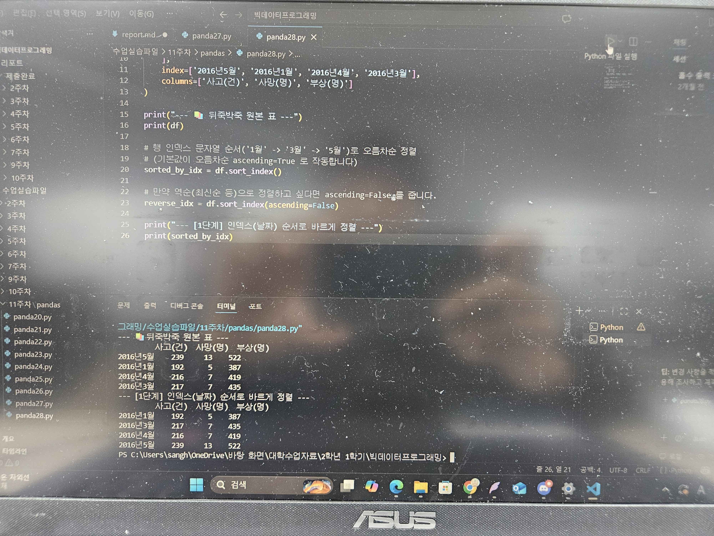
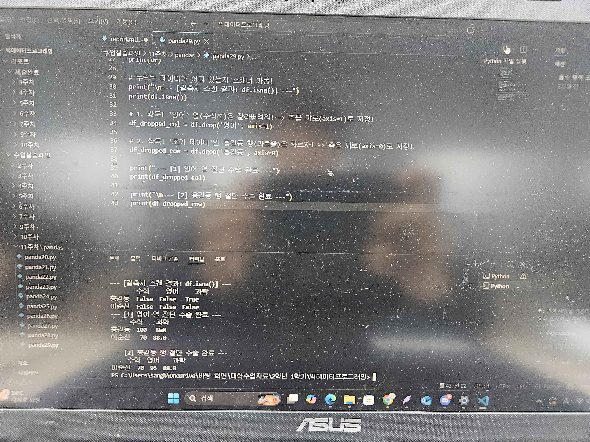

# 11주차 리포트

## DataFrame에서 열(Column)만 쏙 뽑아내기

## 조건식을 이용한 행(Row) 추출 (Boolean Indexing)

## .loc[] 를 이용한 행(Row) 타게팅

## .loc 와 .index 콤보로 순번(i) 기반 행 참조하기

## .loc 돋보기로 열(Column)만 쏙 뽑아보기

## .loc 와 .columns 콤보로 순번(i) 기반 열 참조하기

## .loc[행, 열] 교차점 투영 (행과 열 동시 참조)

## .iloc[행, 열] 좌표 번호(Integer Location) 기반 참조

# ㅡㅡㅡㅡㅡㅡㅡㅡㅡㅡㅡㅡㅡㅡㅡㅡㅡㅡㅡㅡㅡㅡㅡㅡㅡㅡㅡㅡㅡㅡㅡㅡㅡㅡㅡㅡㅡㅡㅡㅡㅡㅡ

## .sort_index와 .sort_values (쌍끌이 정렬 기법)

## 데이터 전처리 공방: 결측치, 수정, 제거, 변경
