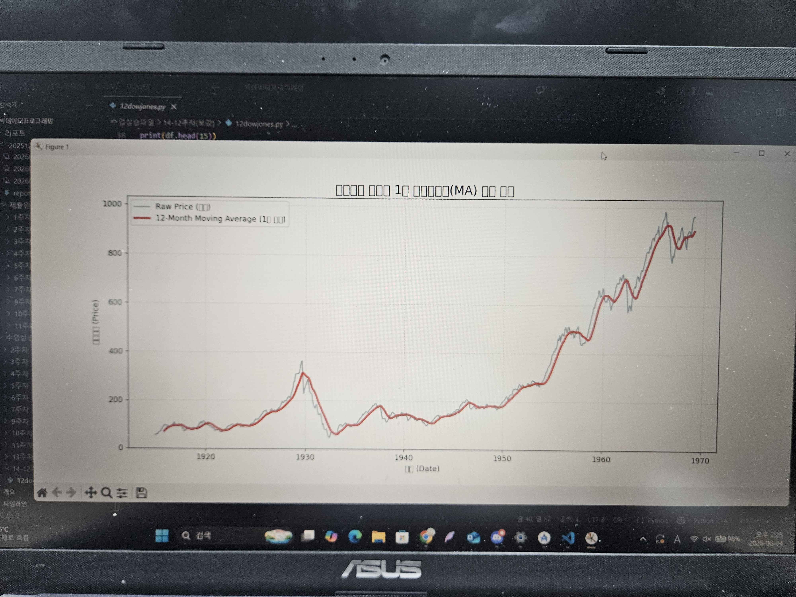
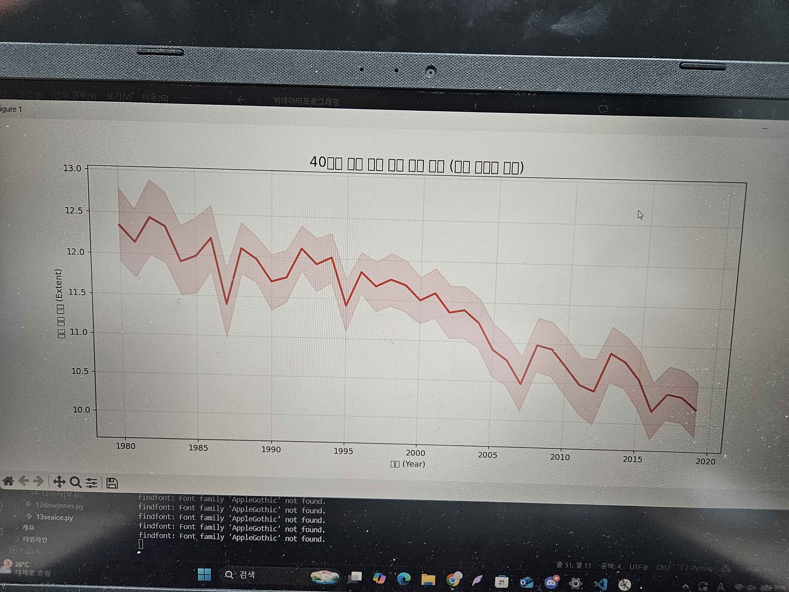
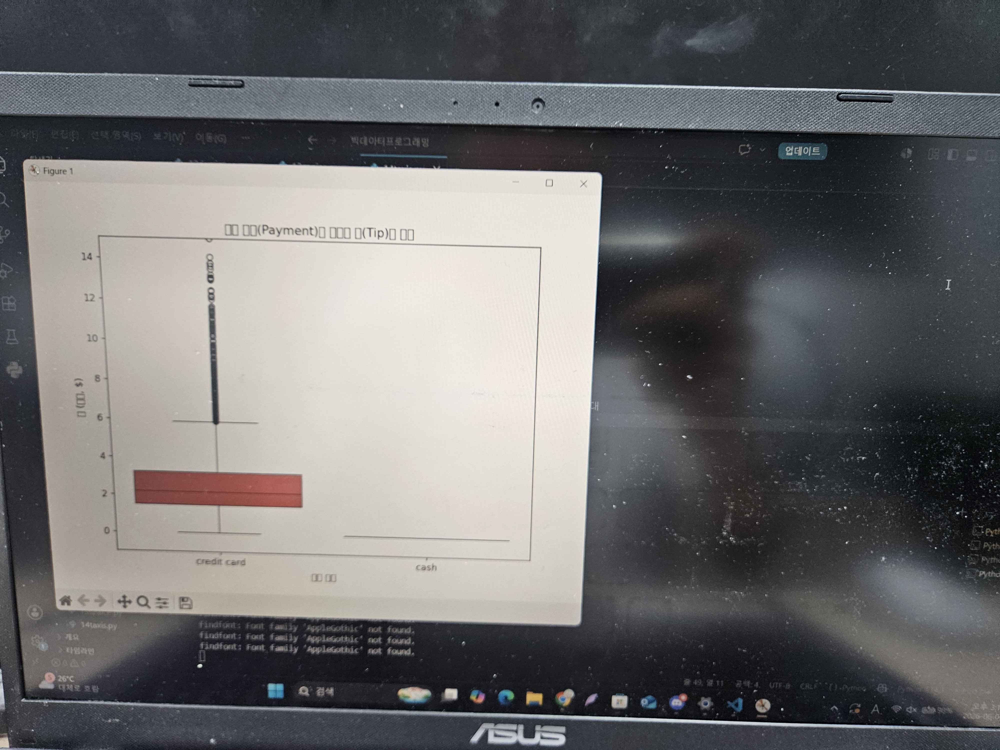
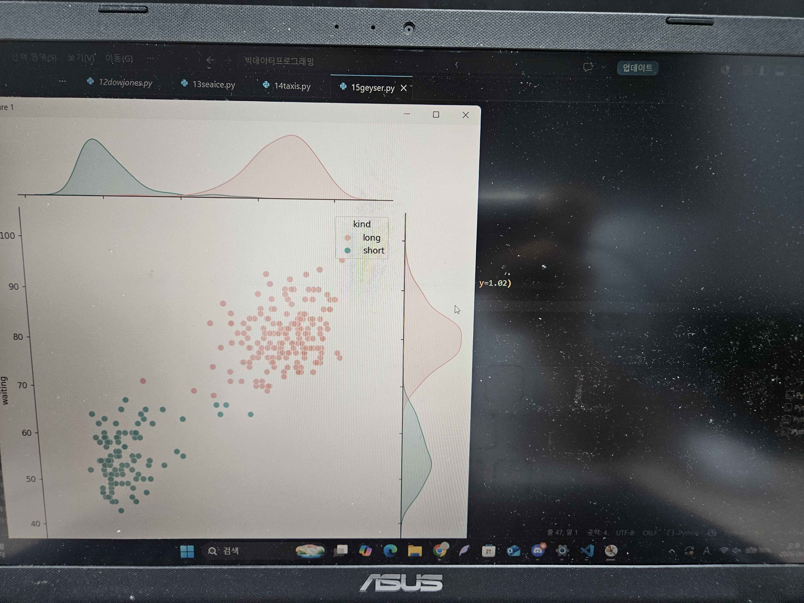
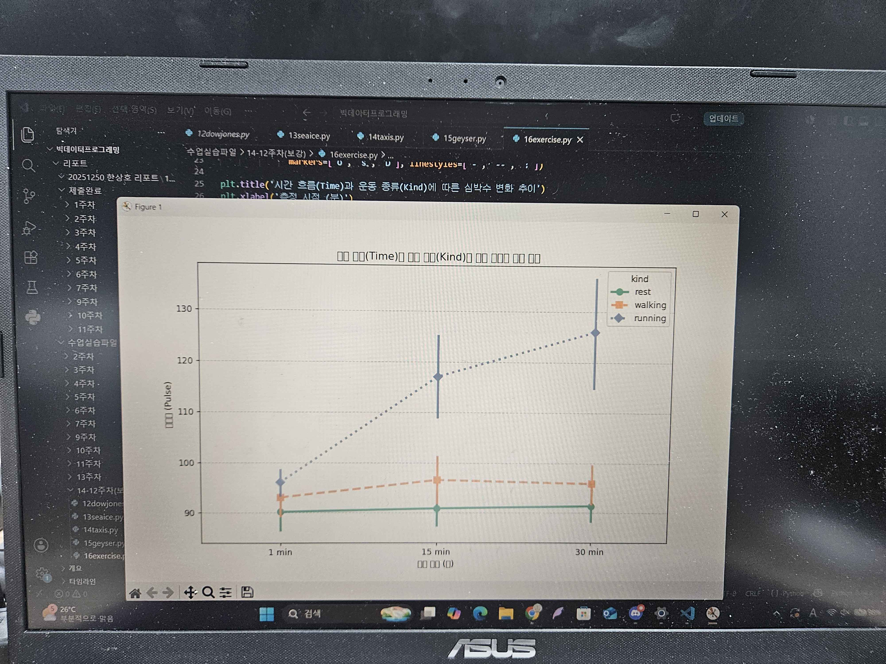
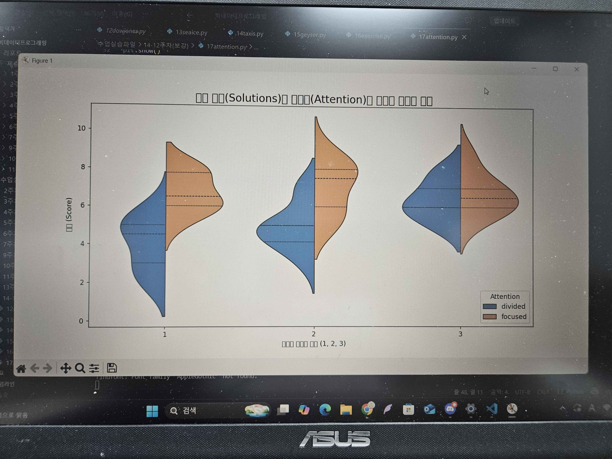
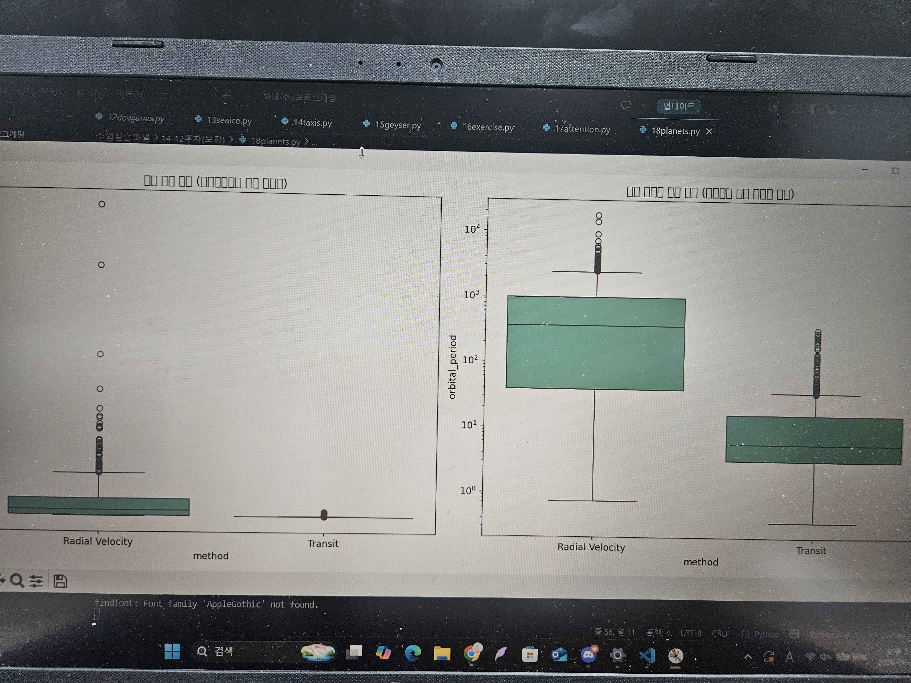
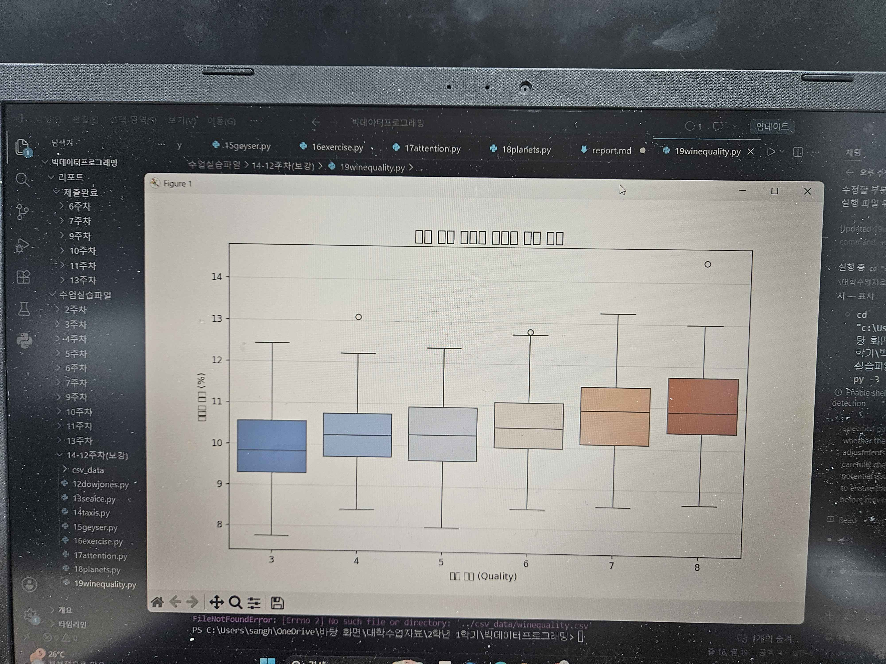
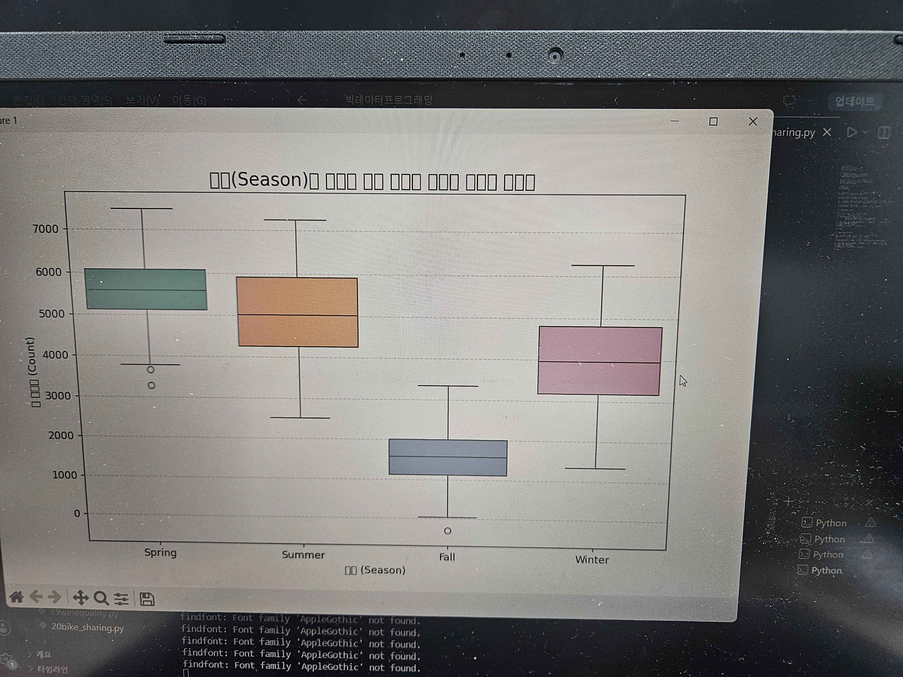

# 12주차(보강 6.4) 리포트

## 데이터 분석 실습

### 다우존스 100년의 역사와 이동 평균선(Moving Average)

### 미시적 계절성과 거시적 기후 변화 (Datetime 심화)

### 뉴욕 택시 시계열 전처리와 숨겨진 비즈니스 로직

### 간헐천 쌍봉형(Bimodal) 분포와 등고선 시각화

### 범주형 시계열 데이터와 상호작용 효과 (Pointplot)

### 멀티태스킹의 비효율성과 분산 분석(ANOVA)의 기초

### 결측치의 진실과 로그 스케일(Log Scale)의 구원

### 로컬 CSV 데이터 로드 및 타겟 상관관계 분석

### 시계열 피처 엔지니어링과 회귀 시각화
