# 11주차 리포트

## 데이터 분석 실습

### 타이타닉 생존자 예측 (Titanic)
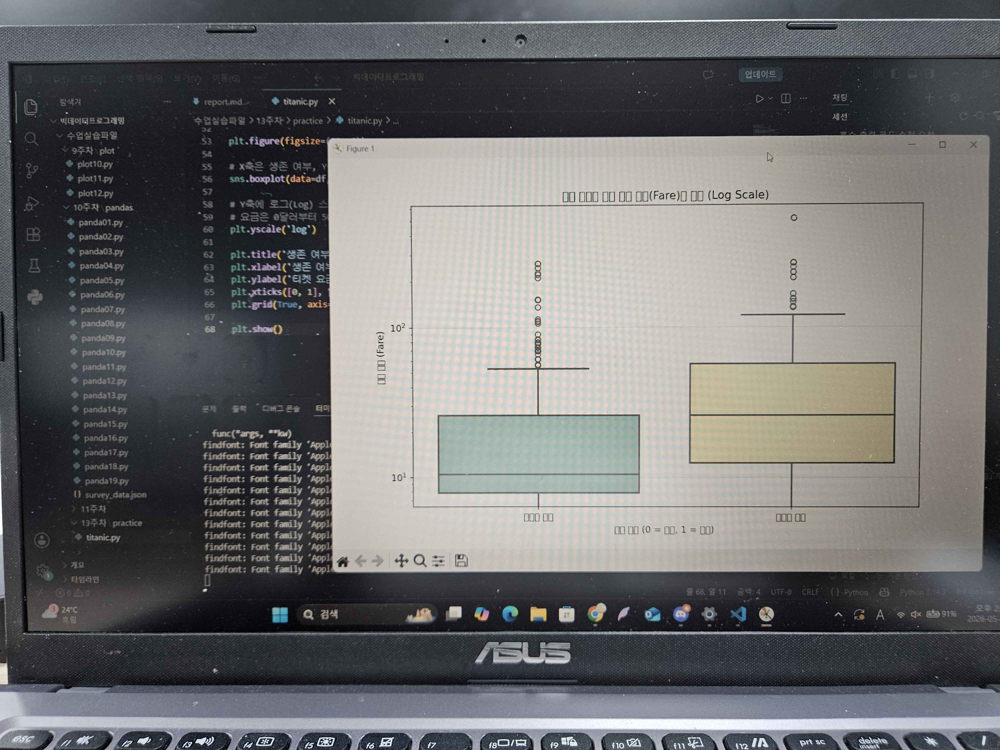

### 붓꽃(Iris) 품종 분류
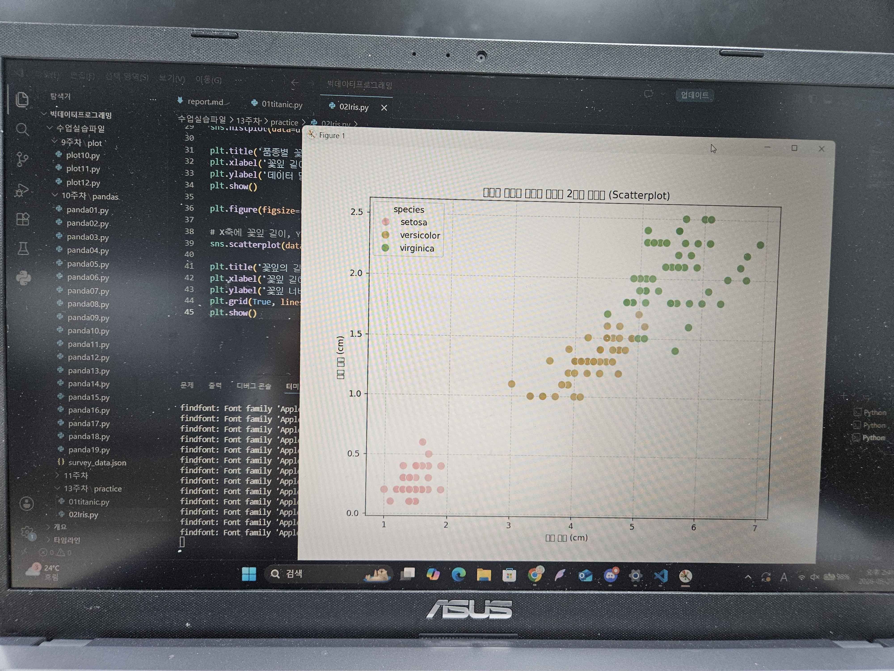

### 남극 펭귄(Penguins) 신체 측정과 심슨의 역설
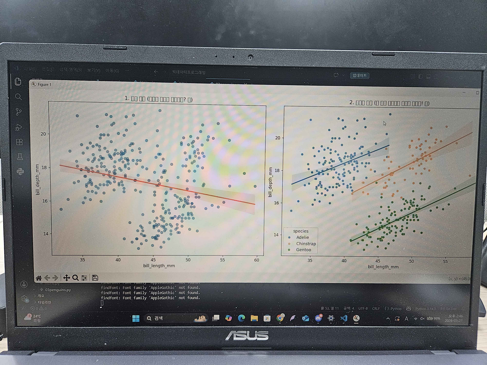

### 레스토랑 팁(Tips) 분석과 피처 엔지니어링
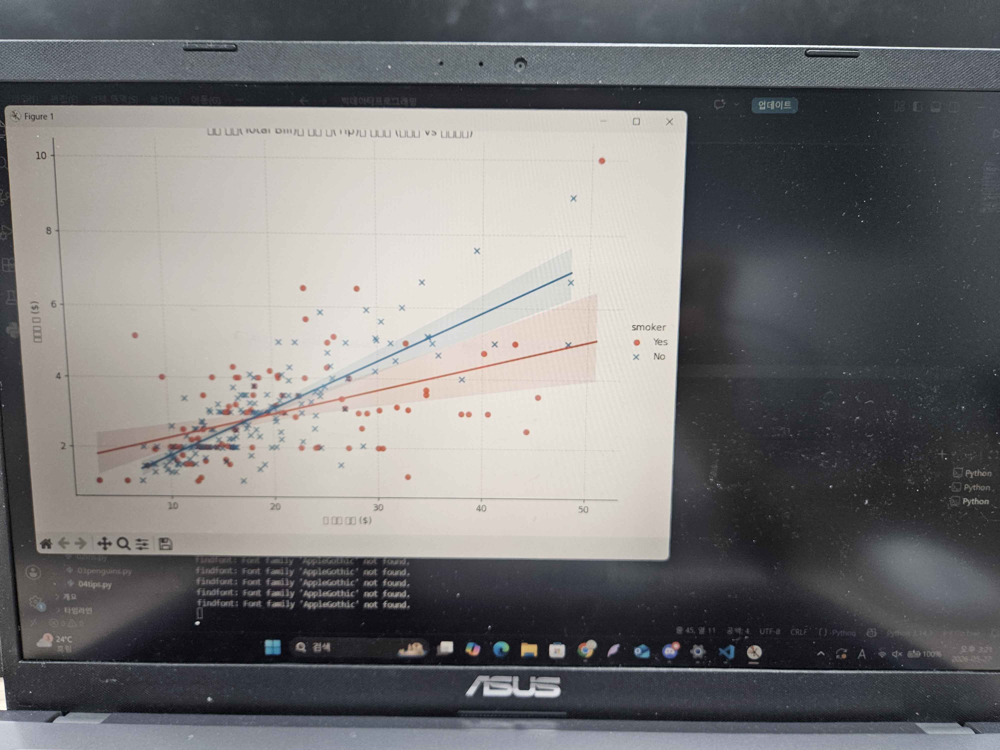

### 다이아몬드 가격 분석과 논리적 이상치 처리
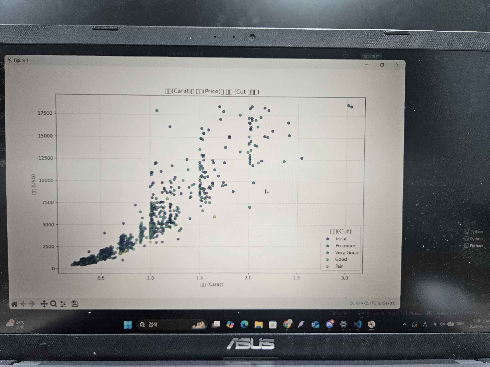

### 자동차 연비(MPG) 분석과 스마트 결측치 대치
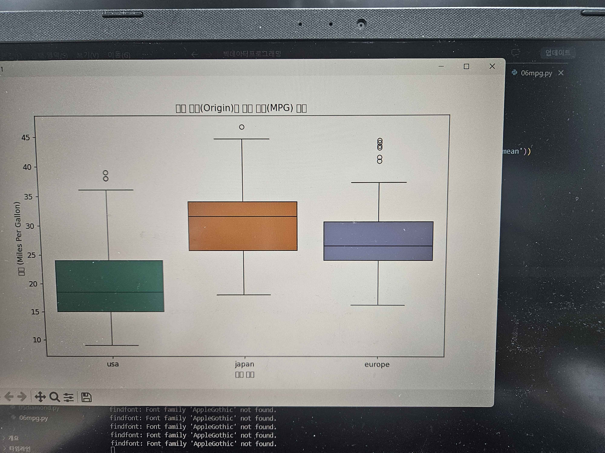

### 앤스콤 콰르텟 (Anscombe’s Quartet)과 시각화의 힘
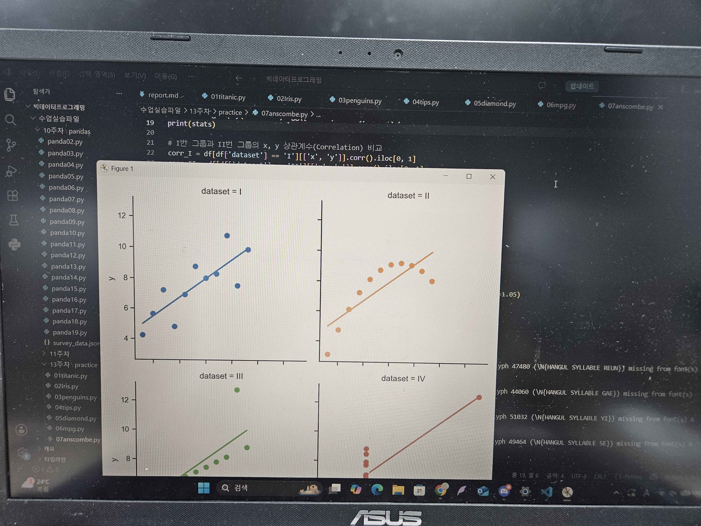

### 교통사고와 음주운전의 상관관계 및 페어플롯
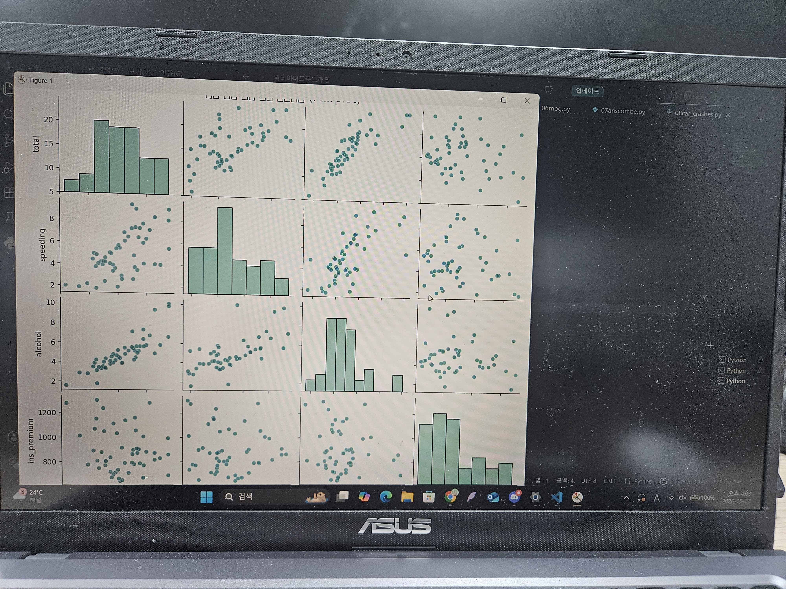

### 항공기 탑승객 시계열 분석과 히트맵
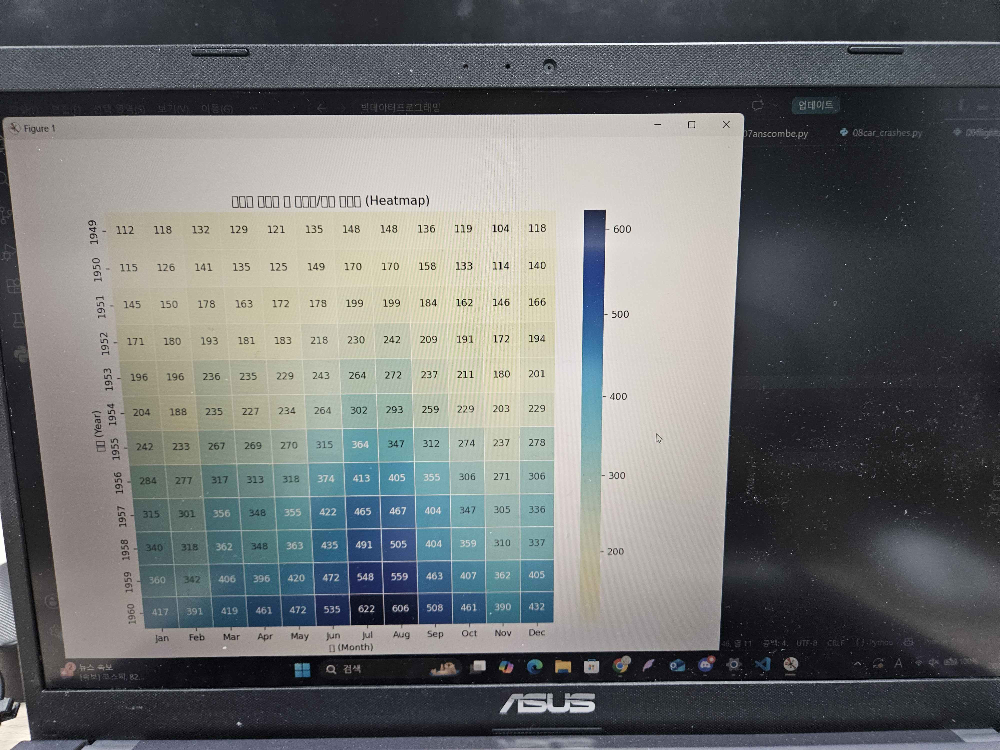

### fMRI 시계열 분석과 신뢰구간(Confidence Interval)
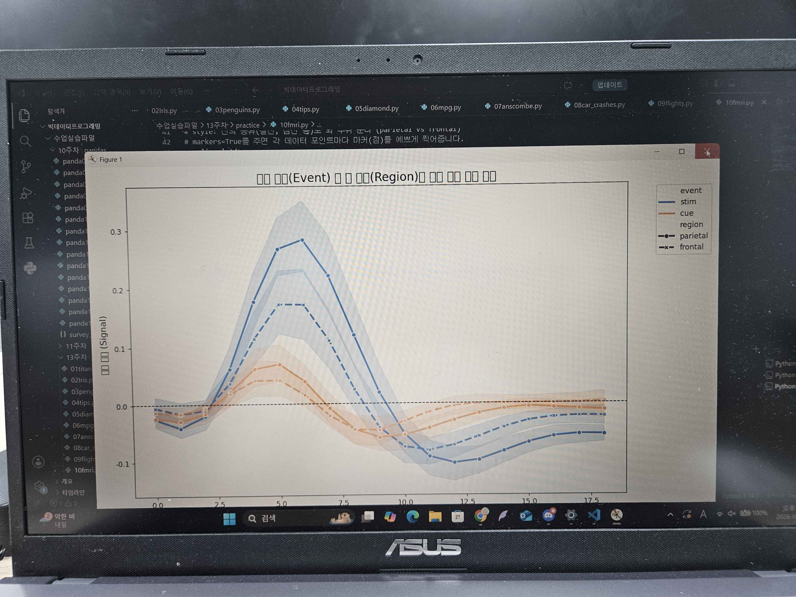

### 의료비와 기대수명의 경제학 (수확 체감의 법칙)
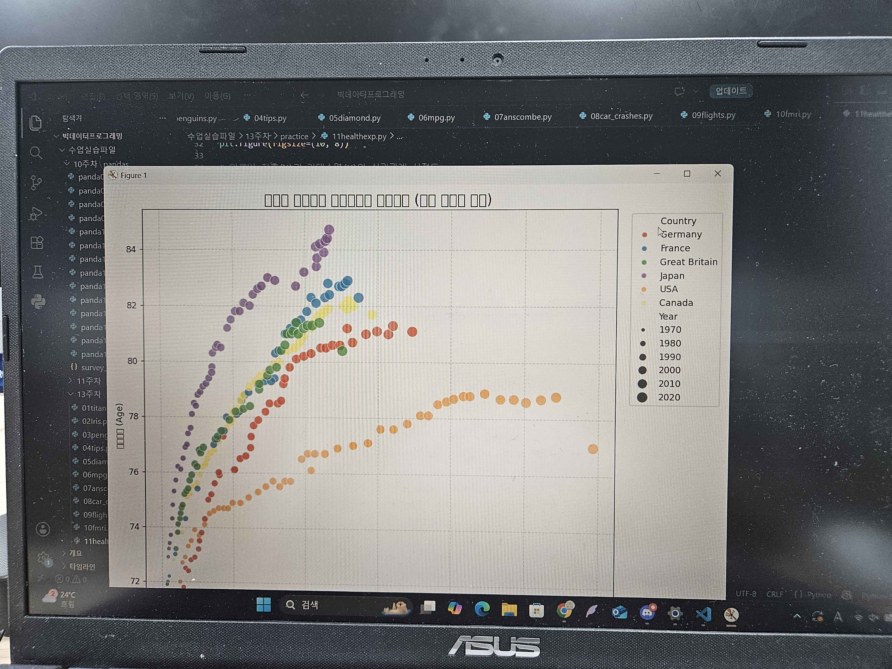

