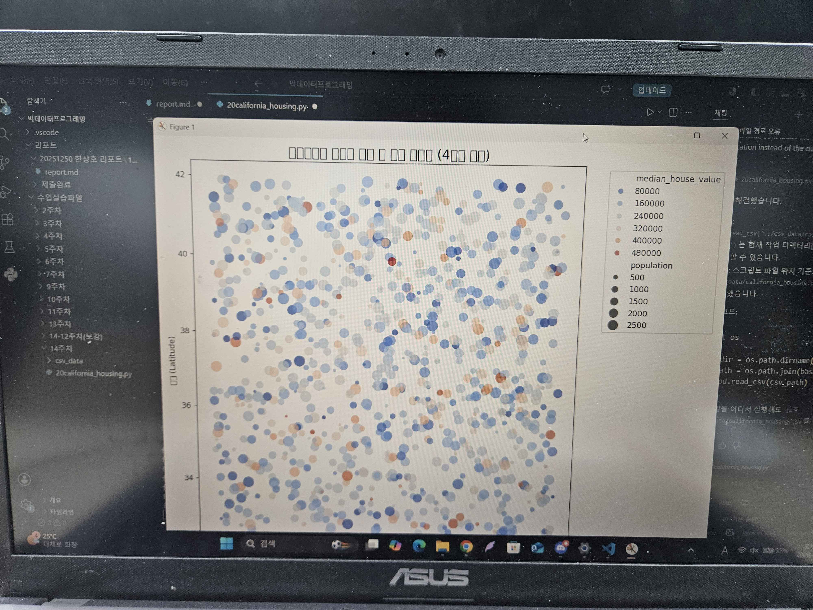
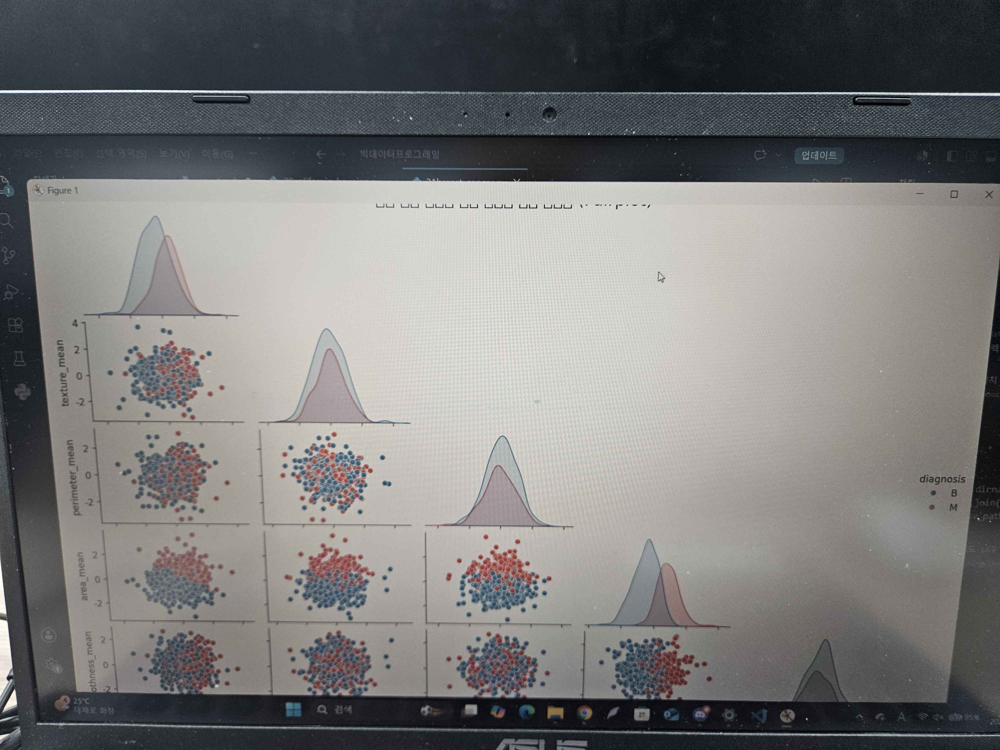
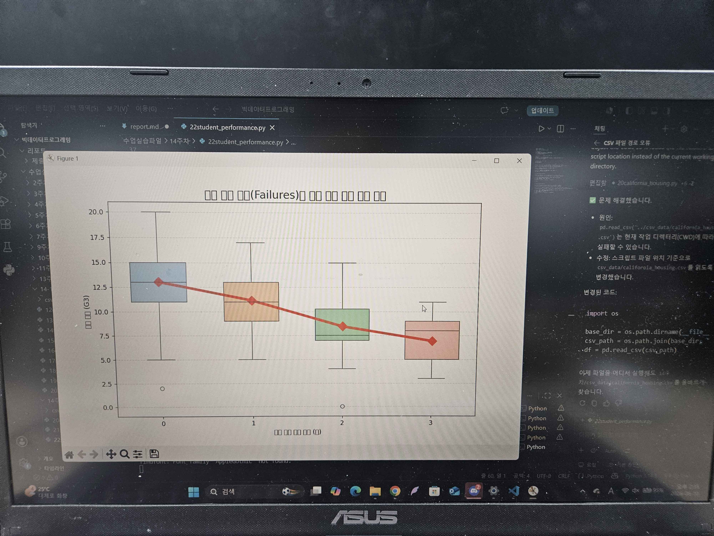
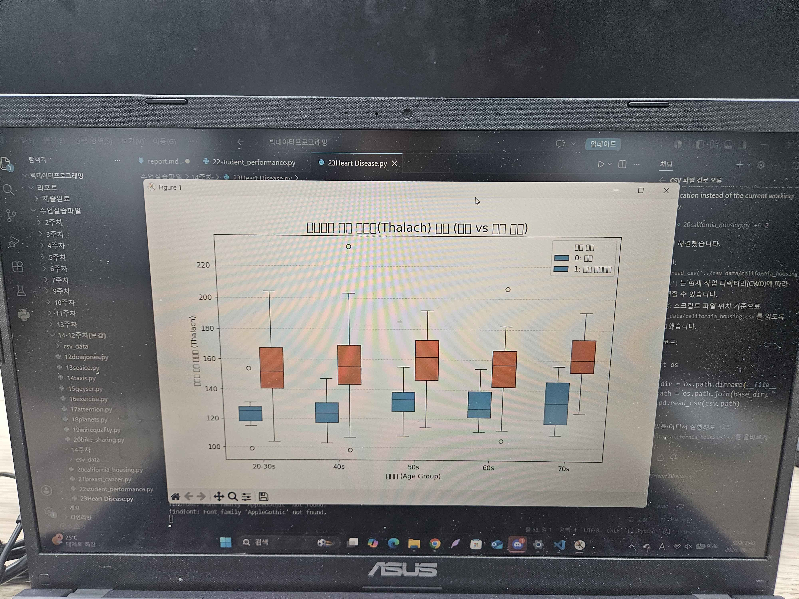
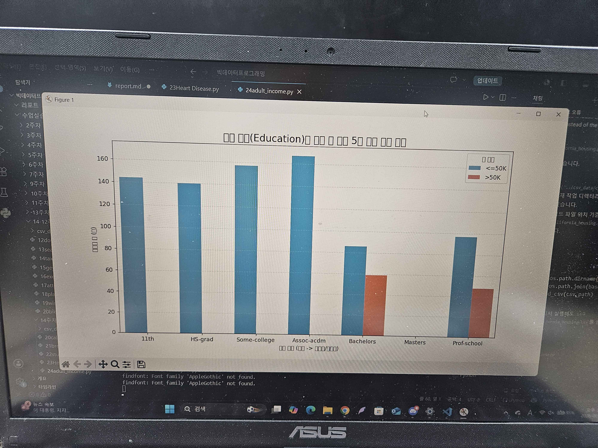
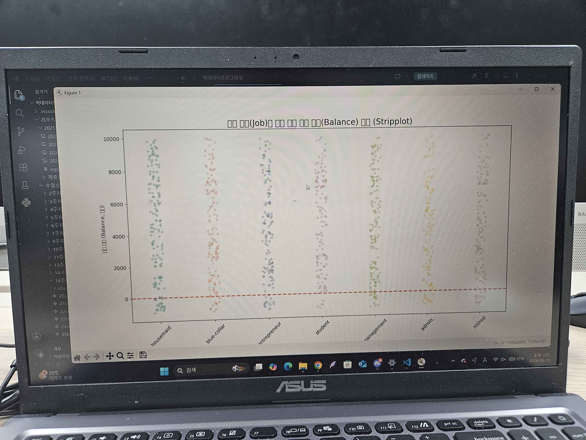
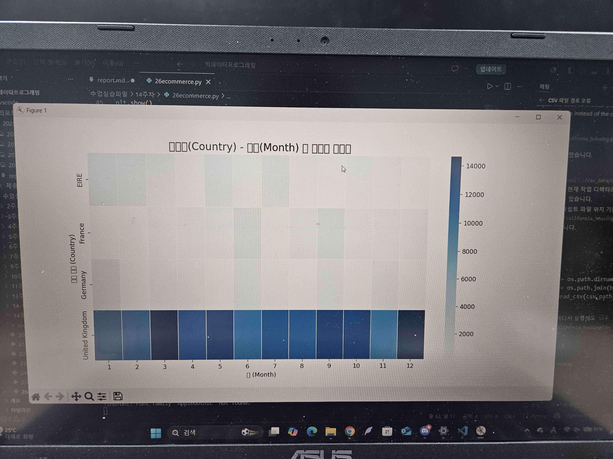
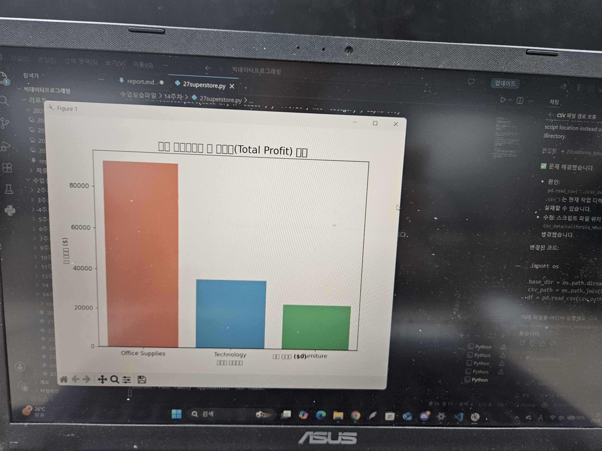
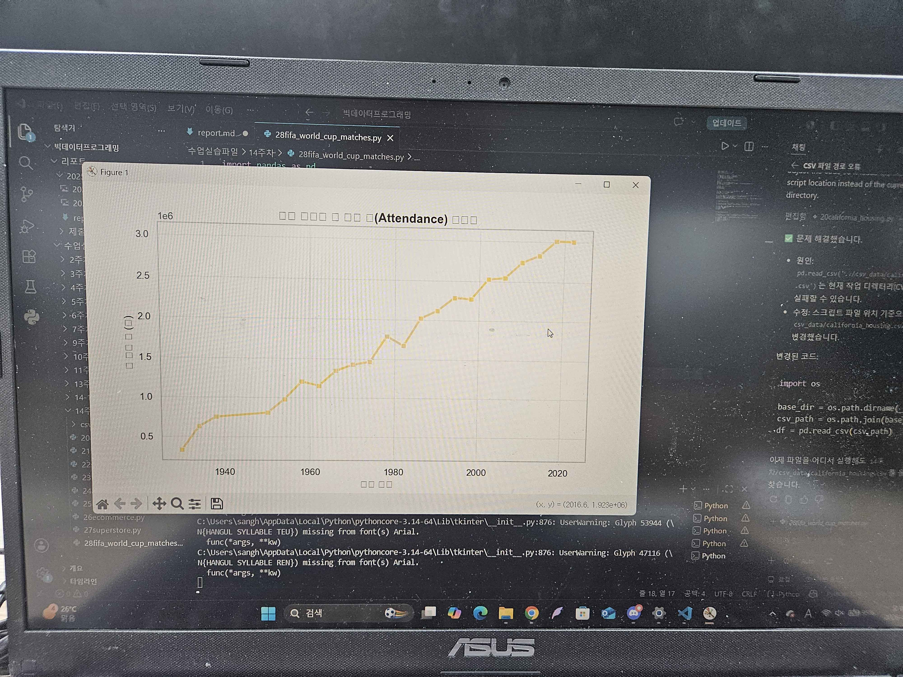

# 14주차 리포트

## 데이터 분석 실습

### 인위적 이상치(Ceiling Cap) 제거와 4차원 지리 데이터

### 유방암 종양 진단 (Violinplot과 Pairplot)

### 학생 성적 예측과 다중 플롯 오버레이

### 심장 질환 예측 (Binning과 그룹별 박스플롯)

### 소득 예측과 기만적 결측치(Imposter) 처리

### 은행 마케팅 성공 예측과 Stripplot의 시각적 파워

### 이커머스 매출 분석과 피벗 히트맵

### 글로벌 슈퍼스토어 비즈니스 KPI 분석

### 역대 FIFA 월드컵 대회 지표 및 최다 우승국 역사적 트렌드 분석

