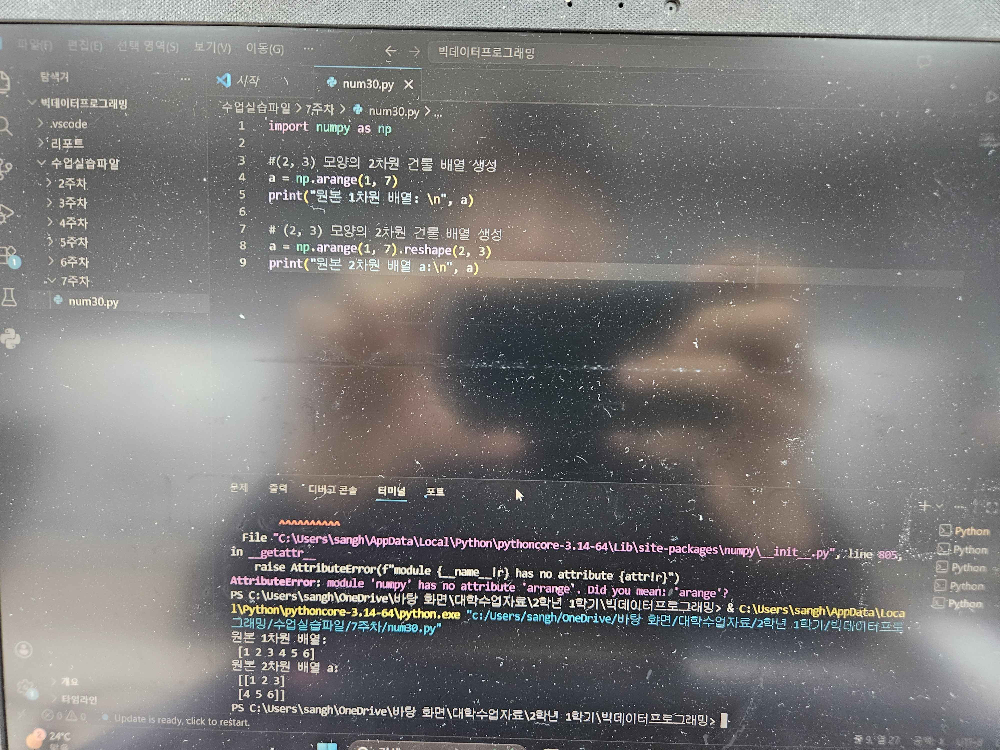
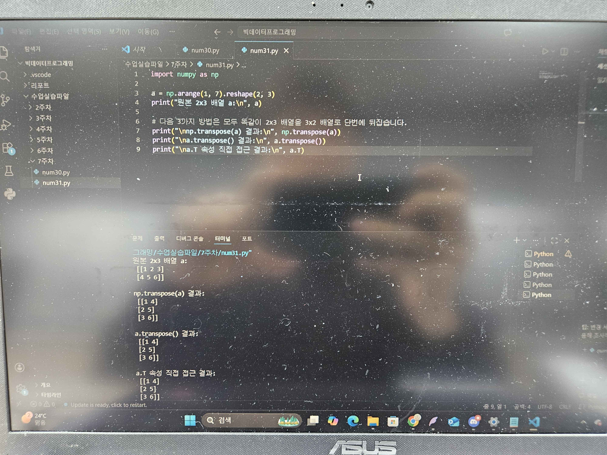
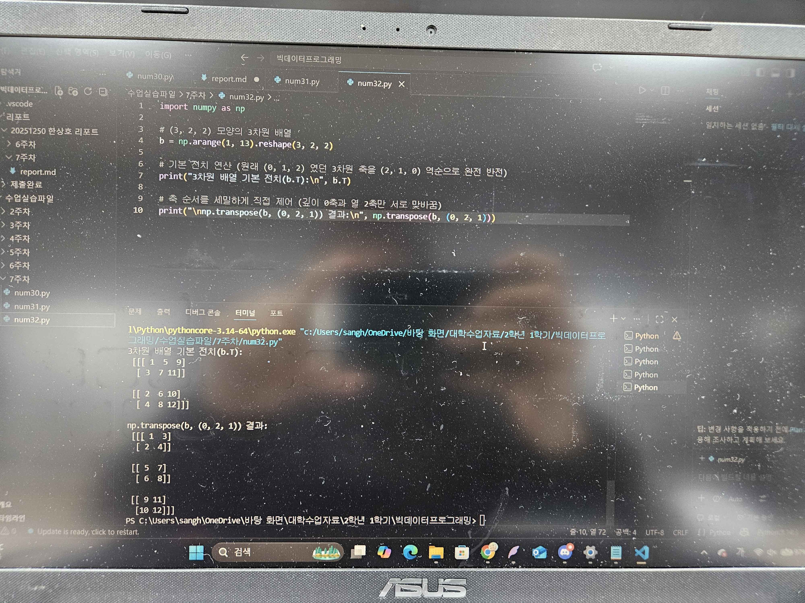
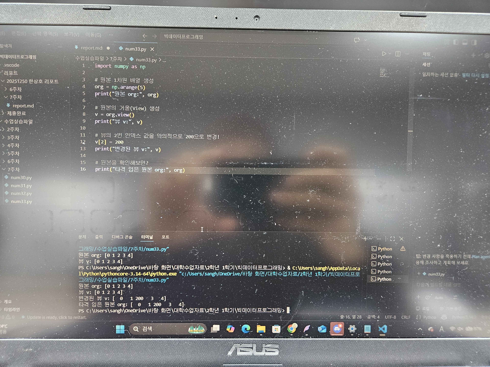
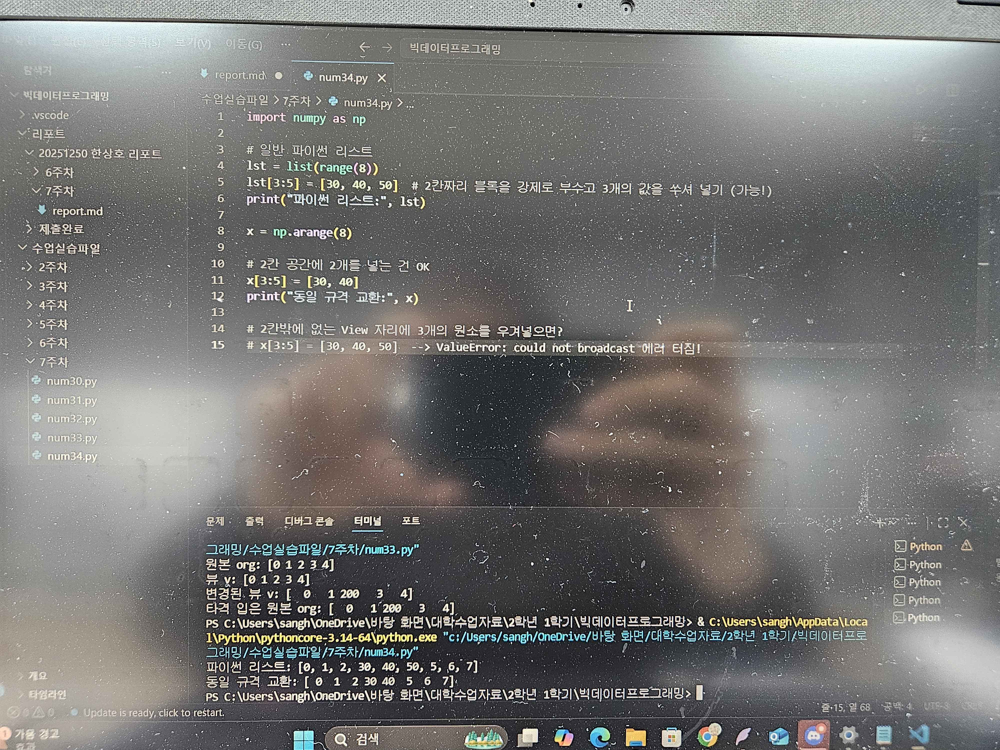
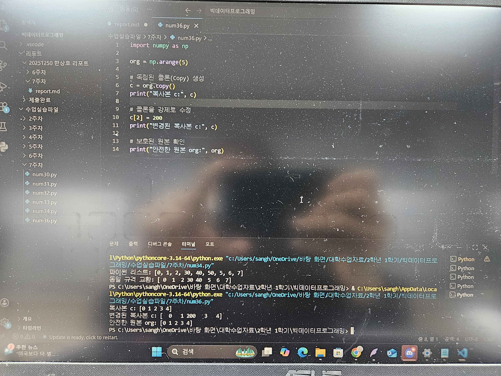
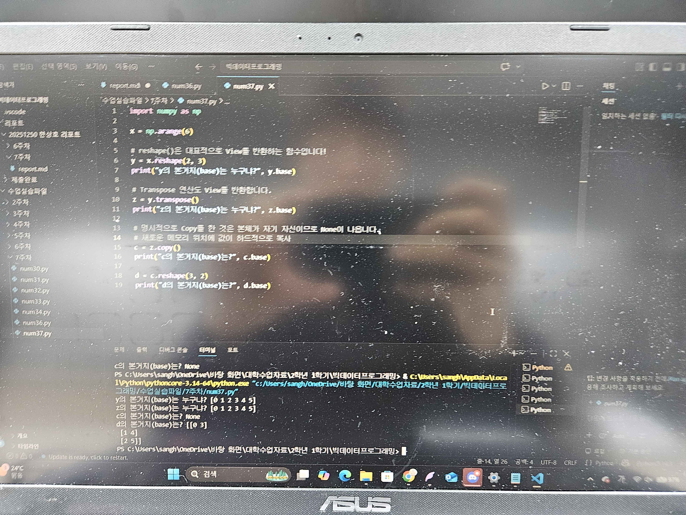
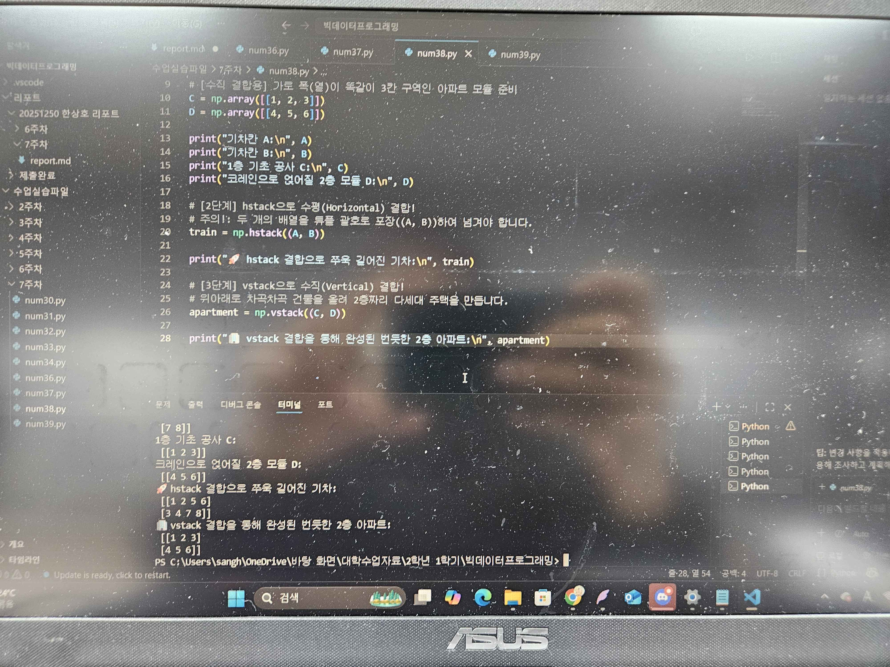
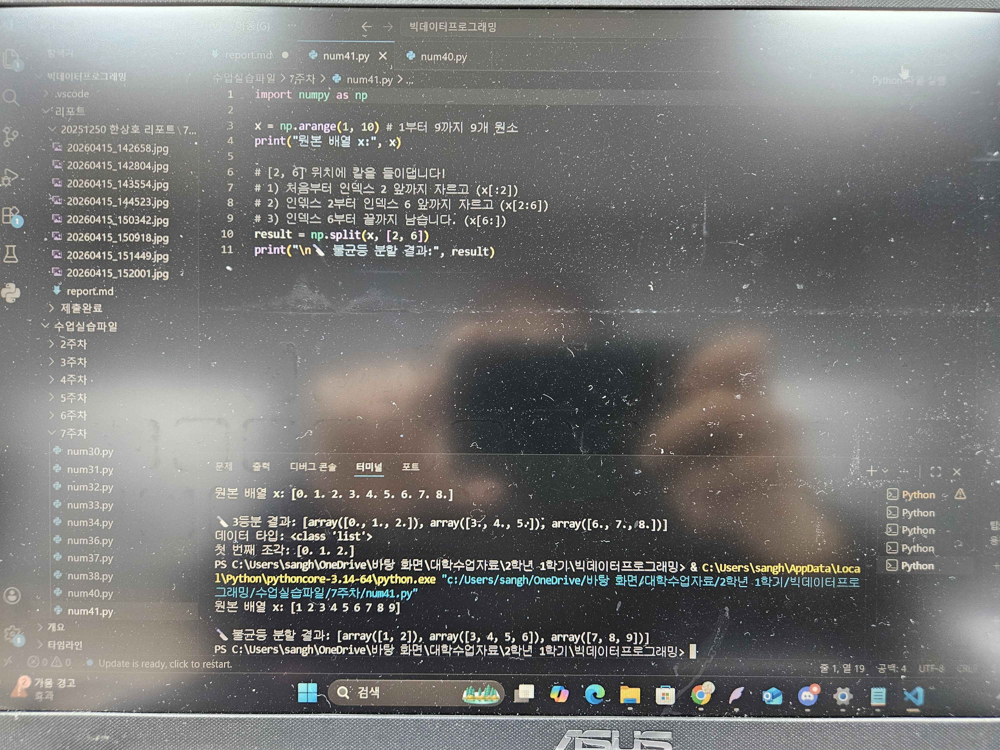
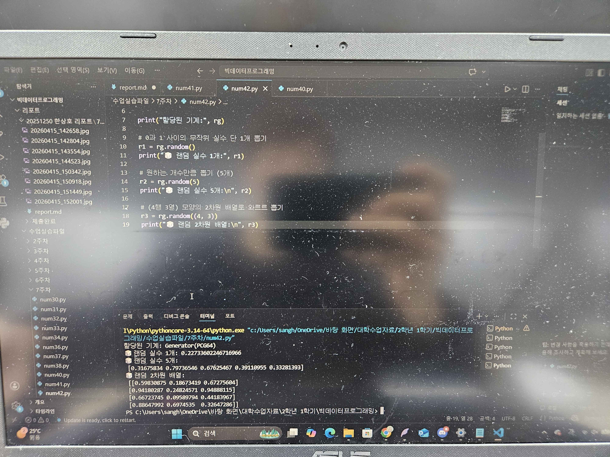

# 7주차 리포트

## 배열 평탄화

## 전치와 축 교환
### 2차원 배열의 전치 (행과 열 뒤집기)

### 3차원 고차원 배열의 축(Axes) 제어 전치

## 메모리 뷰 (View)와 얕은 복사
### 보기(View)

### 뷰(View)의 한계점: 파이썬 리스트와의 형태 구조 차이 

## 독립적인 클론 생성과 추적 (Copy)
### 독립적이고 안전한 클론 본체: 복사(Copy)

### 내 족보(출처) 확인하기: .base 속성 추적 

## 배열 결합 
### 개요 

### 배열 분할의 기본 np.split()

## 난수 생성

