# 9주차 리포트

# 판다스
## pydataset 전체 데이터셋 목록 확인
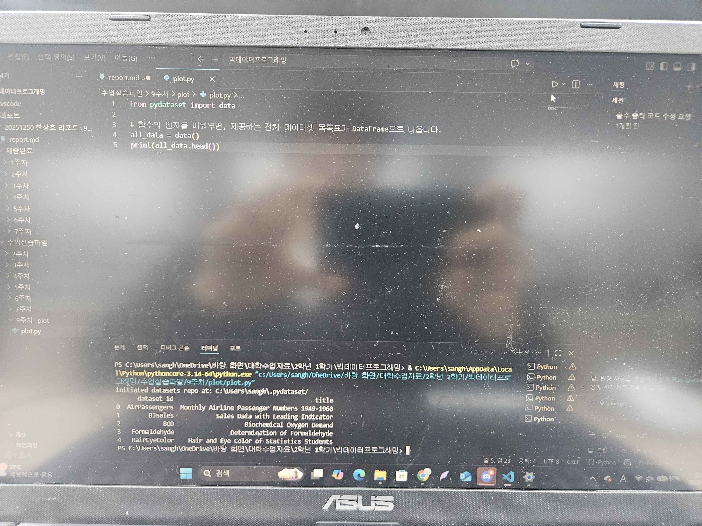
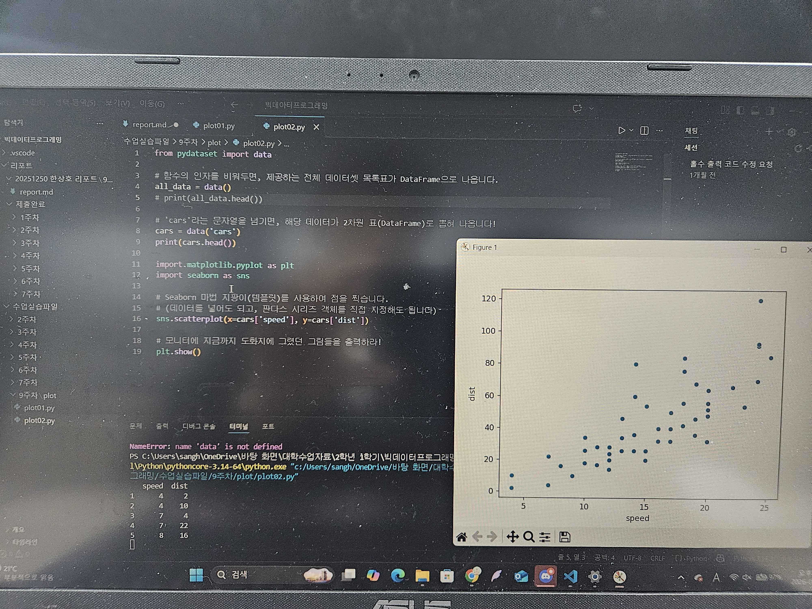
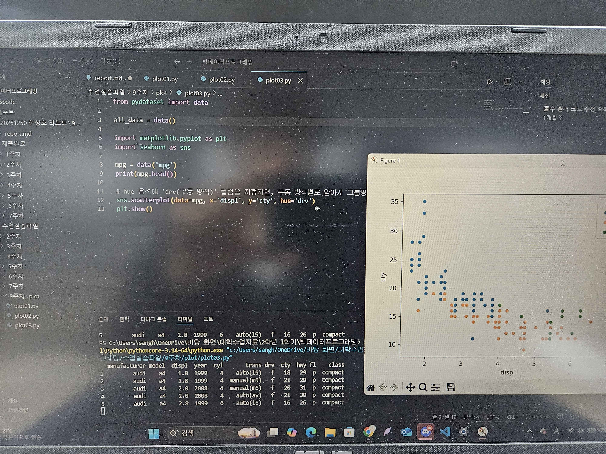

## 데이터 시각화
### 선 그래프 (Line Plot)
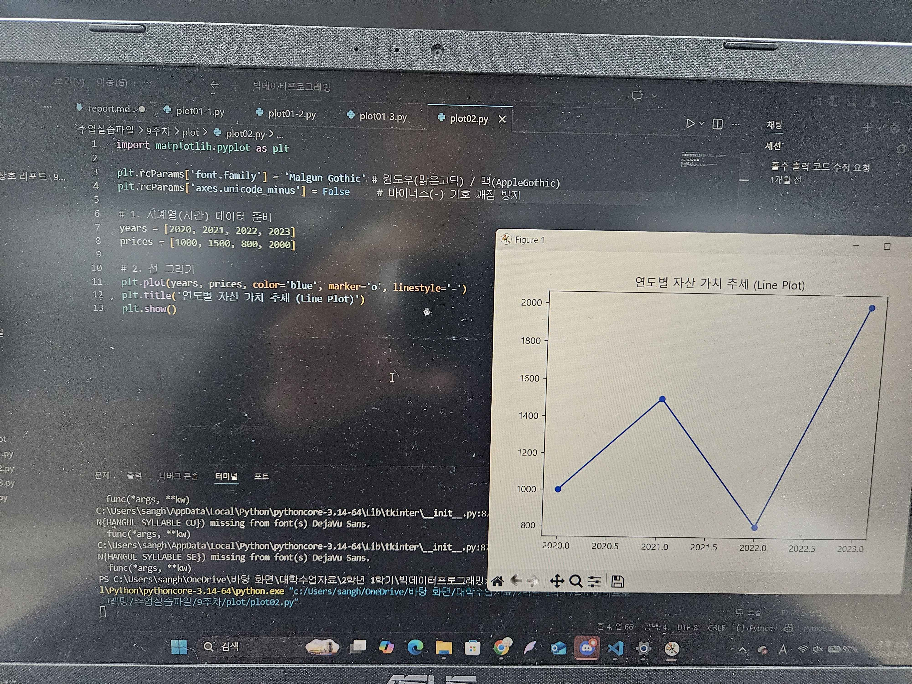

### 산점도 (Scatter Plot)
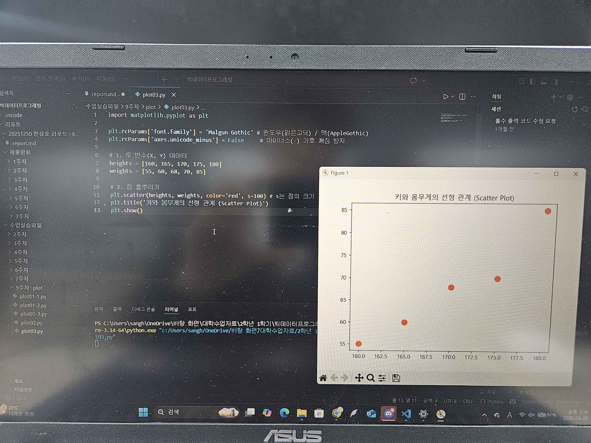

### 막대 그래프 (Bar Chart)
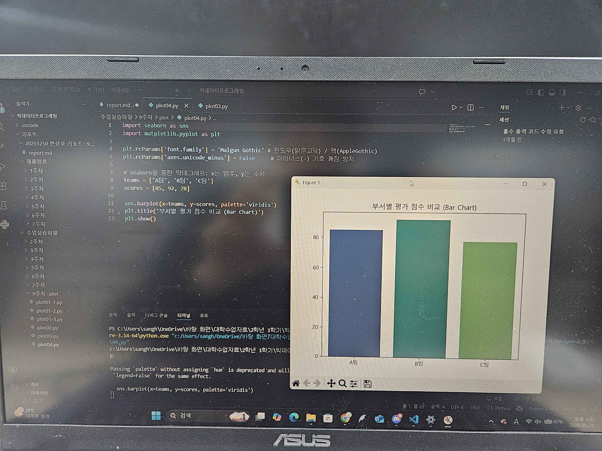

### 히스토그램 (Histogram)
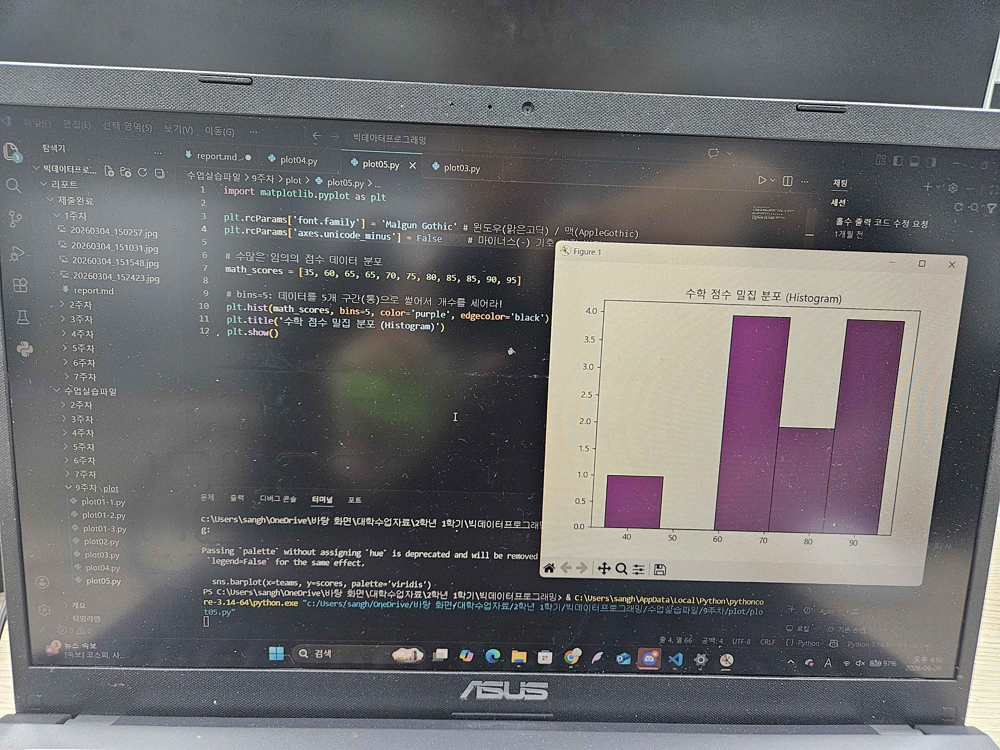

### 파이 차트 (Pie Chart)
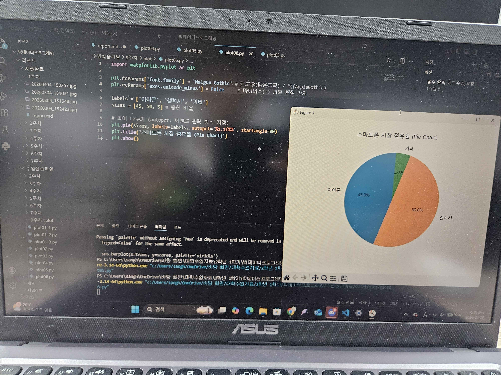

## 가장 단순한 선 그래프 (Line Plot)
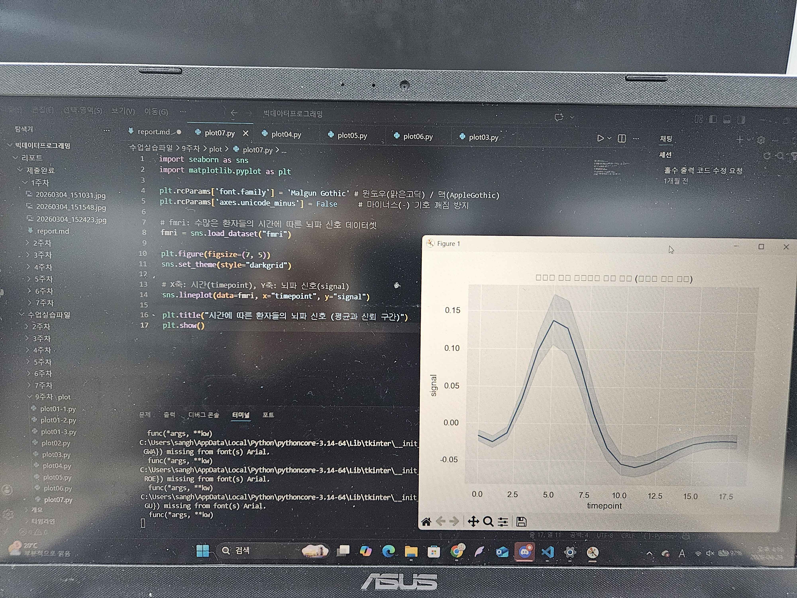

## 산점도 (Scatter Plot)와 고차원 매핑
### 점의 크기(size)와 버블 차트
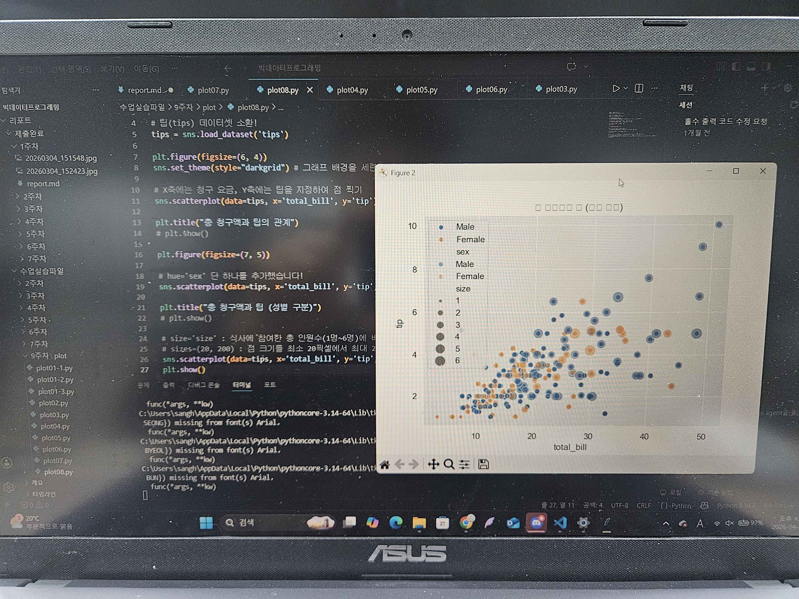

## 파이 차트 (Pie Chart) 한계탈출
### 도넛 차트 (Donut Chart)
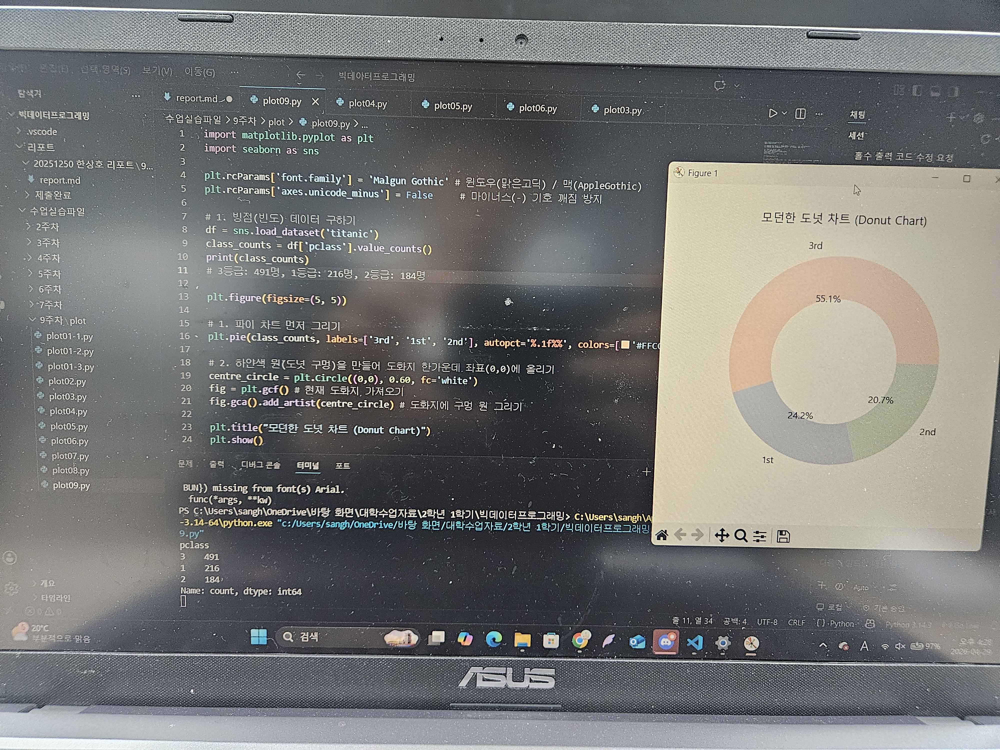

## 시각화 고급 꾸미기
### plt.subplot (절차적, 과거 방식)
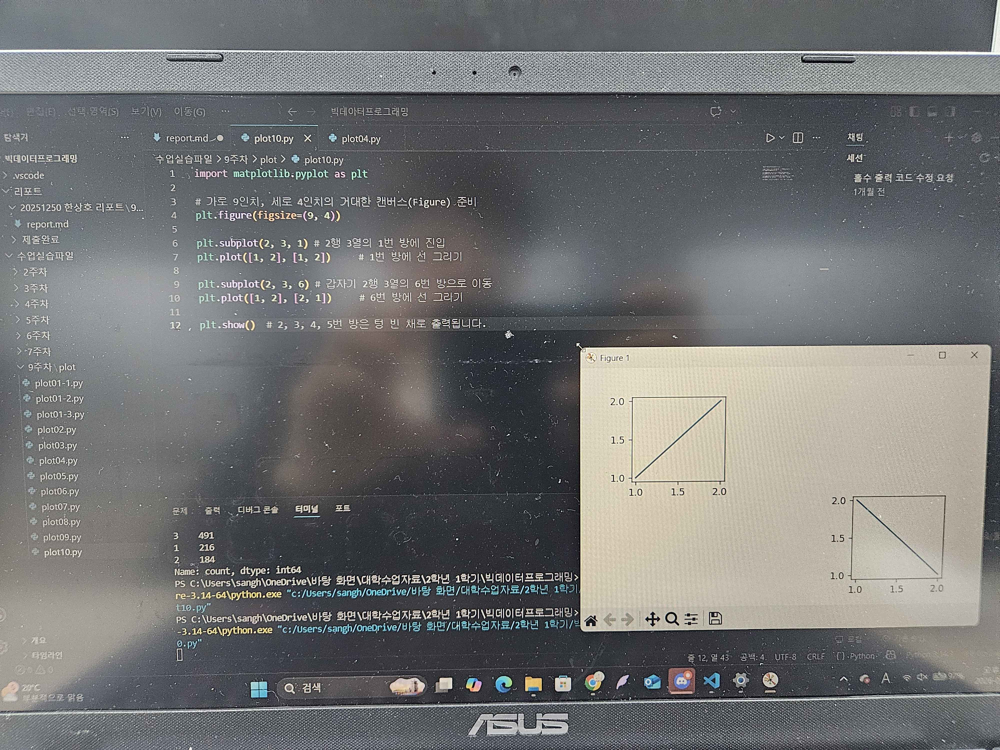

### 유자재 화면 쪼개기: GridSpec 레이아웃
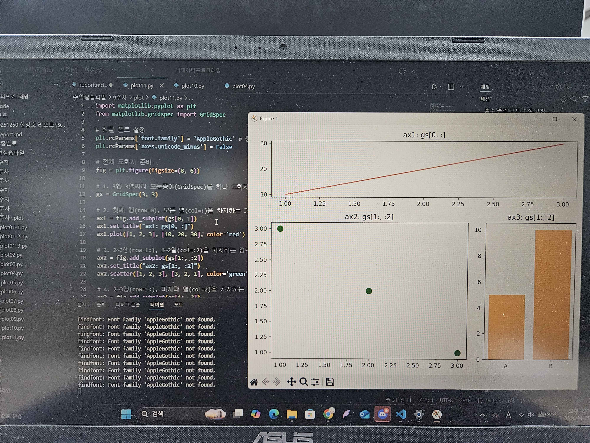

### 스타일링 종합 실습
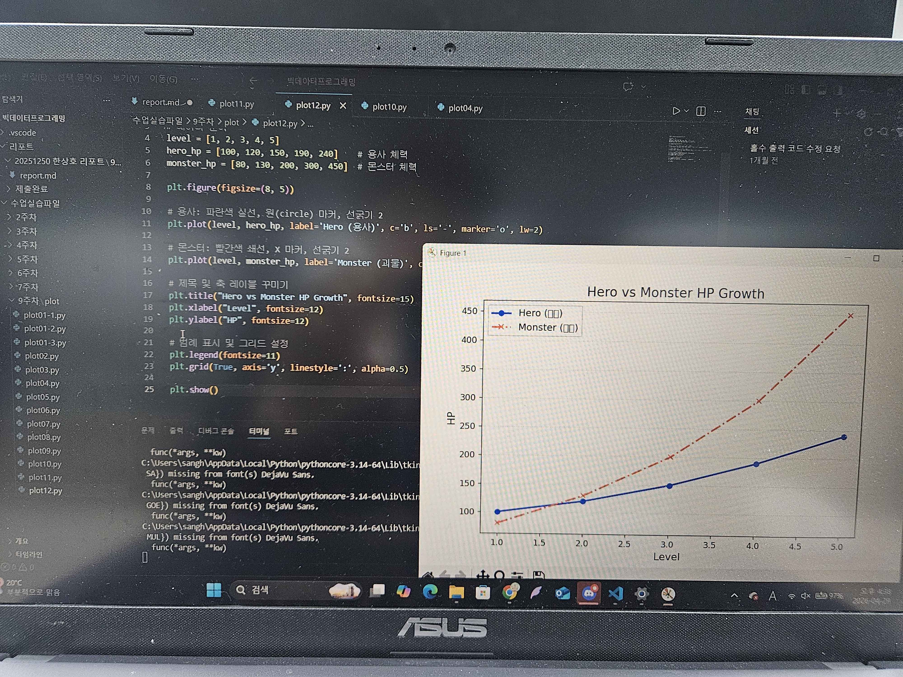